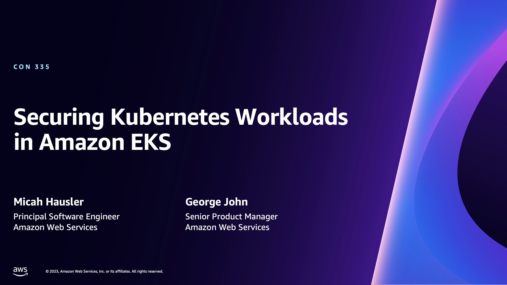

# AWS re:Invent 2023 CON335 - Securing Kubernetes Workloads in Amazon EKS - Demo

This repo contains setup scripts used to demonstrate [EKS Pod Identity (2023)](https://aws.amazon.com/about-aws/whats-new/2023/11/amazon-eks-pod-identity/) and [EKS Cluster Access Management (2023)](https://aws.amazon.com/about-aws/whats-new/2023/12/amazon-eks-controls-iam-cluster-access-management/). 
* [Slides](https://d1.awsstatic.com/events/Summits/reinvent2023/CON335_Securing-Kubernetes-workloads-in-Amazon-EKS.pdf)
* [YouTube](https://www.youtube.com/watch?v=iyMcOpXRVWk&list=PL2yQDdvlhXf93SMk5EpQVIq4kdWQhUcMV)


<a href="https://www.youtube.com/watch?v=iyMcOpXRVWk&list=PL2yQDdvlhXf93SMk5EpQVIq4kdWQhUcMV"></a>

## EKS Pod Identity 


## EKS Cluster Access Management


## Setup

You'll need the AWS CLI installed, as well as node, 
```bash
brew install node asciinema agg kubernetes-cli
npm install -g aws-cdk
```

To set up the VPC for EKS clusters, IAM roles, and an S3 bucket, use the provided CDK.

```bash
cdk bootstrap
cdk deploy
```

Once you have that setup, edit `demos/env.sh` and insert the outputs from your CDK stack.

```bash
cd demo
source env.sh
```

Now you can setup your EKS clusters.

```bash
CLUSTER_NAME=red-fish ./cluster-setup.sh

CLUSTER_NAME=blue-fish ./cluster-setup.sh

# I only used a third cluster for the CAM demo in order to run it in EKS's pre-production environment. 
# A third cluster is not stricly necessary.
CLUSTER_NAME=gold-fish ./cluster-setup.sh
```

### EKS Pod Identity Demo

Under `demos/pod-identity`, there is a [README](./demos/pod-identity/README.md) with full runthrough steps for the demo.

### Cluster Access Management

Before running this demo, you'll need to configure the `demos/cluster-access-management/aws_config.ini` file with a method of getting credentials.

```bash
cd demos/cluster-access-management
source env.sh
./run.sh cam-demo.sh
```

## License

See [LICENSE](LICENSE), Apache 2.0, 
